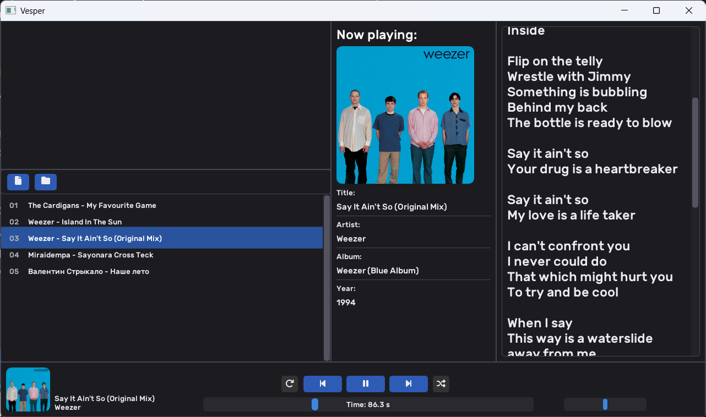

# **Vesper**
**Local music player with metadata, lyrics, and spectrum visualization**

<p align="center">
  
  
  
  
  
</p>

<p align="center">
  
  
  
  
  
  
  
  
  
</p>



> ⚠️ Unstable version — may contain bugs or incomplete features.

---

## Features

- Modern dark interface (ImGui + GLFW)
- Tag and album art parsing
- Automatic lyrics fetching via lrclib.net
- Streaming audio playback (OpenAL + FFmpeg)
- Cross-platform: Windows ⋅ Linux ⋅ macOS

---

## Planned Features

- **Next:** Real-time spectrum visualizer, drag & drop, playlists, search  
- **Future:** Settings, EQ

---

## Build 
```bash
git clone https://github.com/eteriaal/Vesper.git
cd Vesper
cmake -B build
cmake --build build
```

## Third-Party libraries
Dependencies are located via CMake find_package:
```cmake
find_package(OpenGL REQUIRED)
find_package(glfw3 REQUIRED)
find_package(GLEW REQUIRED)
find_package(CURL REQUIRED)
find_package(nlohmann_json REQUIRED)
find_package(OpenAL REQUIRED)
find_package(ImGui REQUIRED)
```

## Third-Party Fonts
Fonts included in the fonts/ folder:
- **Font Awesome** — MIT License
- **Rubik** — SIL Open Font License (OFL)

Full license texts and required notices are in the 3RDPARTY-LICENSES/ folder.

## License
Vesper is licensed under the MIT License


## Thanks

- To the authors of all libraries and fonts used in the project
- To lrclib.net for free lyrics database
- To you — for checking this out

### ★ Found a bug or idea? Issues and pull requests welcome!